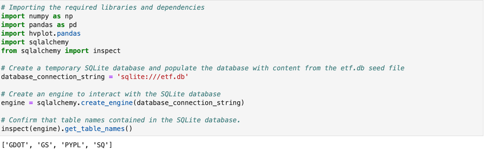
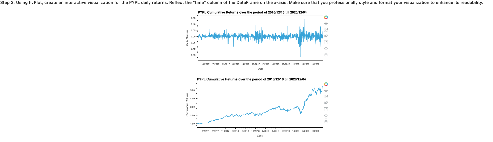
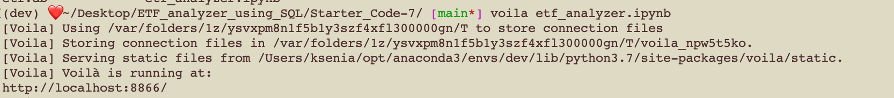
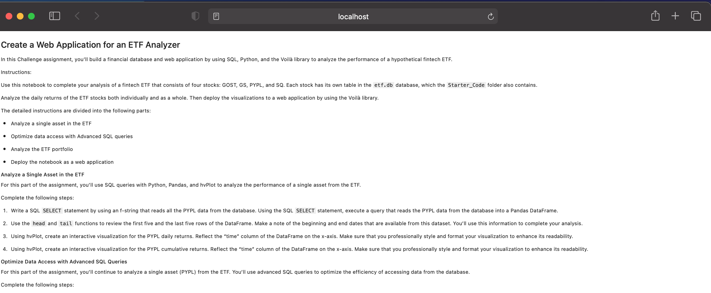

# ETF Analyzer deploying SQL
This project builds a financial database and web application by using SQL, Python, and the Voilà library to analyze the performance of a hypothetical fintech ETF.
ETF (exchange-traded fund)means that you invest in a basket of assets, this way, there is no need to spend excessive time researching individual stocks or companies or take the risk of investing in a single stock. ETFs offer more diversification.


## Technologies 
This project leverages python 3.7 with the following packages:
* Pandas - for financial calculations
* Path - for identifying the file
* sqlalchemy - an open-source SQL library for Python, designed to ease the communication between Python-based programs and databases
* hvplot - holoview plot for interactive visualisations
* Voilà - a Python library, you can convert a Jupyter notebook into a live webpage
* numpy - for advanced mathematical functions

---

## Installation guide 
Thsi project leverages python 3.7 with the following dependencies:

``` python

pip install SQLAlchemy

conda install -c conda-forge voila

 import hvplot.pandas 

```

--- 

 
 This project uses a temporary SQLite database and populates it with content from etf.db
 See the picture below for the details and required libraries and dependencies




---

## Examples 

* Interactive Visualisations using Holoview



* Advanced SQL queries 


## Voila Webpage

To serve a web page locally using Voila, use a terminal to navigate to the directory containing the notebook file and run the following command:


``` python
voila <name_of_the_file.ipynb>
```





## Contributors
Brought to you by Ksenia Gorska as part of the UC Berkeley Extension Bootcamp: UCB-VIRT-FIN-PT-06-2021-U-B-MW Ksenia Gorska
 e-mail: kseniagorska@icloud.com 
[linkedin] (https://www.linkedin.com/in/ksenia-gorska/)

## License

MIT